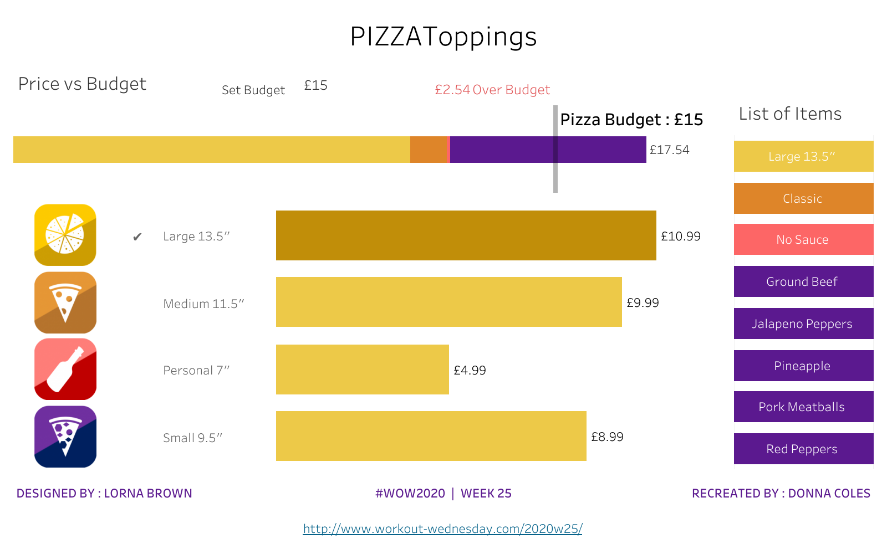
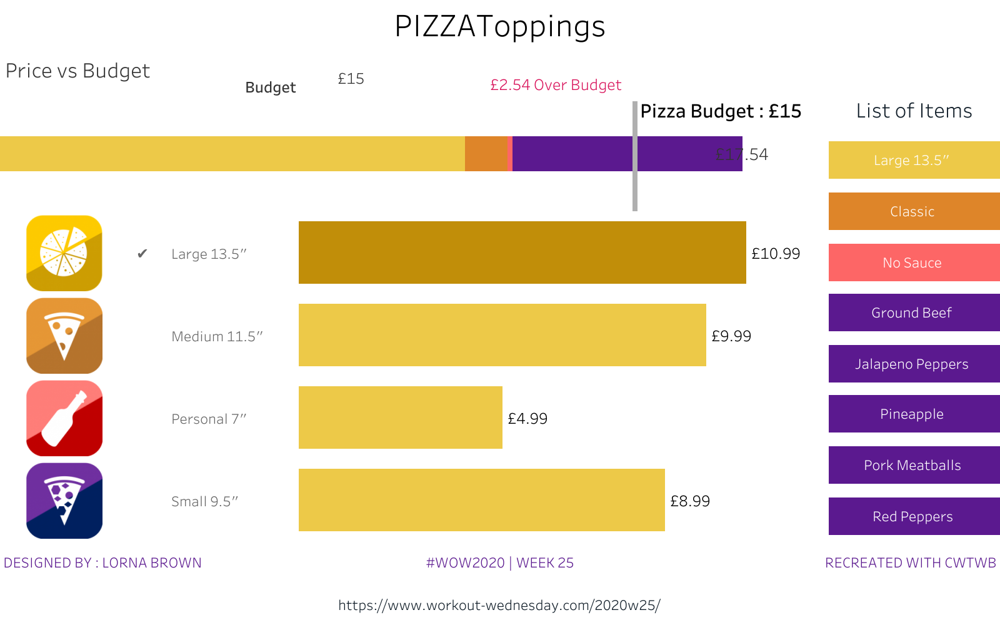
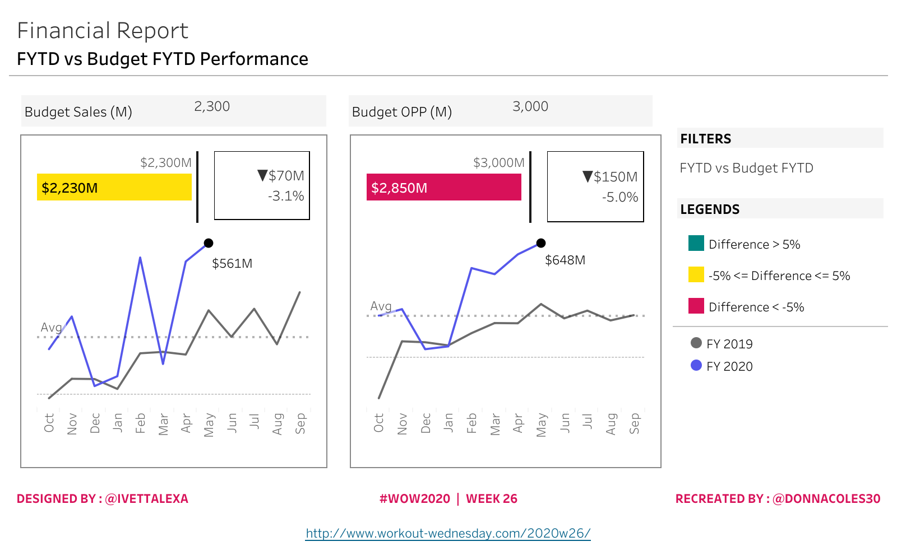
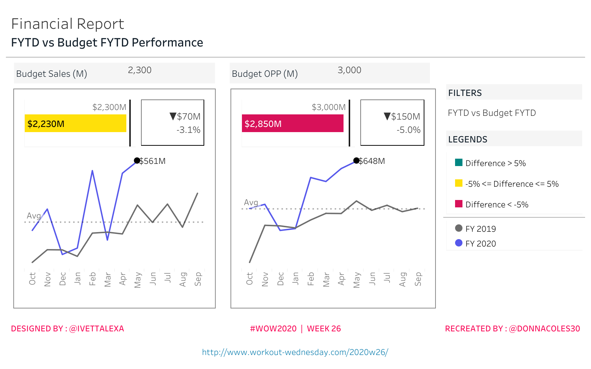
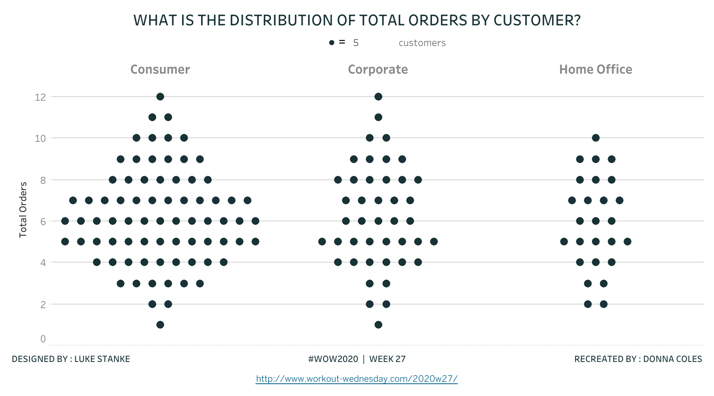
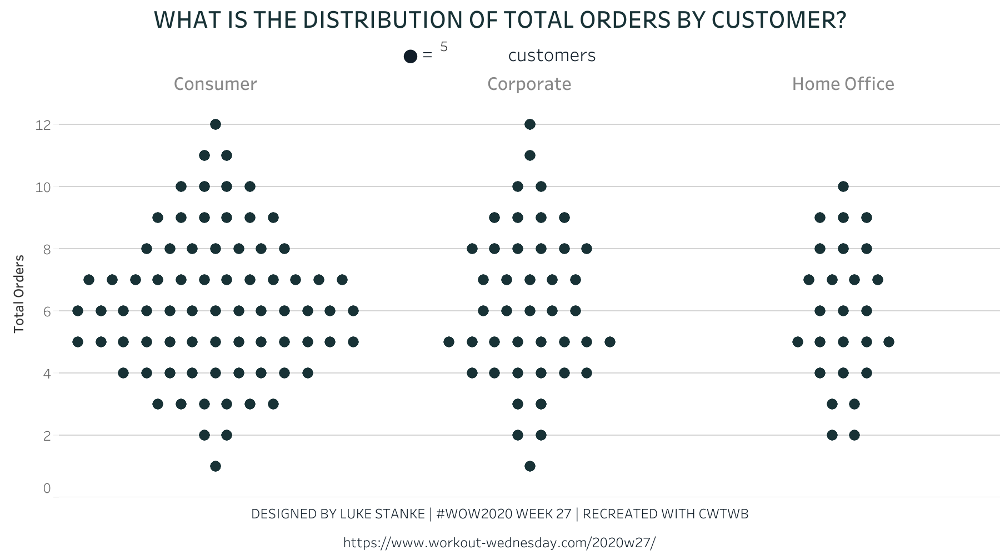
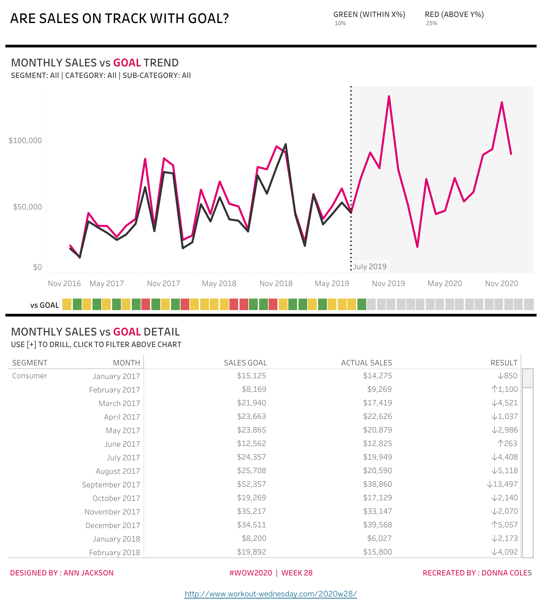
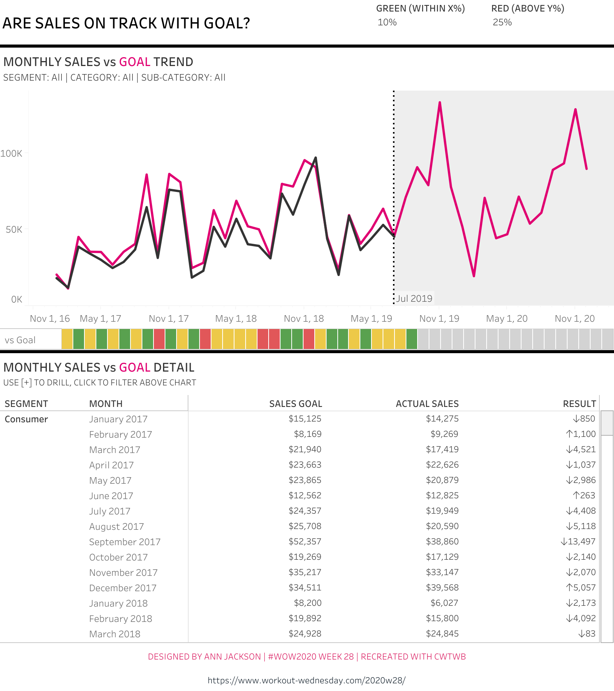
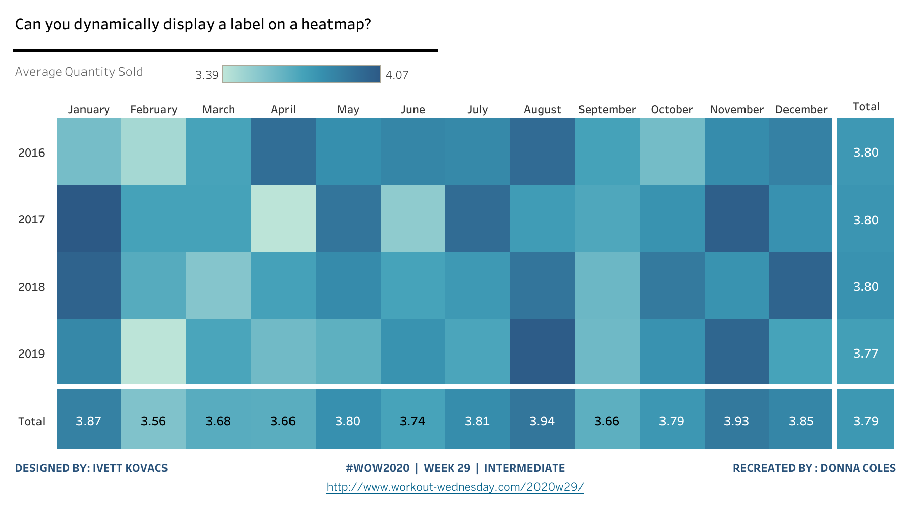
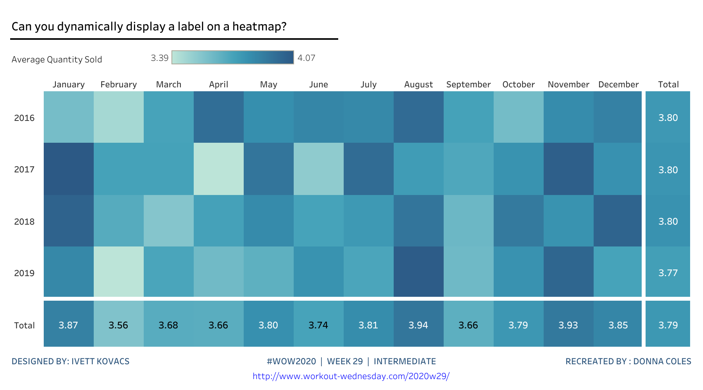

# 2020 WW25–29 Cloud review

Five cases were selected in ascending article-date order after WW24. Every builder starts with `TWBEditor("")` and uses public SDK APIs. Author workbooks were read only during analysis and extraction, and published independently for comparison.

| Challenge | Article date | Official challenge date | Scope |
| --- | --- | --- | --- |
| WW25 | 2020-06-20 | 2020-06-16 | Pizza selection, native set actions, budget comparison and embedded image marks |
| WW26 | 2020-06-27 | 2020-06-23 | October fiscal reporting, budget/prior-year states, KPI and monthly trends |
| WW27 | 2020-07-03 | 2020-06-30 | Customer order distribution with nested dot calculations |
| WW28 | 2020-07-10 | 2020-07-08 | Independent actual/goal logical tables and monthly goal comparisons |
| WW29 | 2020-07-18 | 2020-07-14 | Intermediate heatmap, totals and hover action contracts |

Acceptance covers Cloud REST images and worksheet CSV exports for the declared parameter/filter states, plus independent raw-data and generated-artifact checks. Action sources, targets, event types and clearing behavior are verified in the workbook; no browser click or hover execution is claimed. The result is `replicated / acceptable_delta`, with case-specific visual differences recorded in the linked case evidence; it is not pixel-identical.

The final evidence contains 18 paired REST states, 36 PNGs and 148 worksheet CSVs. Shared repository tests: 57 passed. The catalogue now contains 59 active cases.

## Data coverage

WW25 uses 26 input products and eight initially selected products totaling £17.54. The three budget states are 15, 30 and 5. The original menu-driven Type filter cannot be changed through REST without a source-side LogicException: Chart CSVs cover its initial four Size products. The full product input, selector counts, selected list and total are checked independently. These exports do not prove execution of Add/Remove menu actions.

WW26 checks all 5,582 account facts and 20 observed monthly points. Sales FYTD is 2,229,528,491.50 and OPP FYTD is 2,849,913,515.75. The default OPP difference is approximately −5.0029%, correctly classified below −5%; rounding it to −5% before classification would be wrong. Default, prior-year and low/high-budget states cover all nine declared worksheet exports per role.

WW27 exports all 793 customers per role in each of three Customers Per Point states: 1, 5 and 10. The oracle checks distinct order counts, all 39 segment/order buckets and centered dot coordinates independently.

WW28 retains 9,994 actual rows and 534 unique goals in separate related tables. Full domain completion includes 2,880 default diagnostic cells, 235 Home Office/Furniture cells and 105 Bookcases cells. The raw relationship retains 108 goal-only keys in 2020; these are distinguished from densified cells with nil metrics. Four states export Table, Data, Line Graph and Barcode for both roles. Table display filtering is distinguished from the full diagnostic domain; nil and zero values are not interchangeable. Correct table-calculation dependency closures restored the categorical RAG and goal-line colors without an additional palette API.

WW29 covers the Intermediate version. The author's unresolved Advanced click-total variant is outside scope. Four states export 65, 26, 10 and 4 records per role, 105 paired cells (210 CSV records) overall. Weighted labels and unweighted visual averages are checked separately. Quantity retains raw CSV precision while cell labels display two decimals. The single-cell color legend clips one value in both source and replica; the cells and exported values remain readable and correct.

## Reproducibility

The case environment uses SDK Git commit `cbe200a4a148f1825764de67bd3e8f0e6d01a113`, version 0.27.1, without an editable dependency. SDK regressions: 655 passed, 25 skipped; [SDK CI passed](https://github.com/aidatacooper/cwtwb/actions/runs/37132041935). Each case records an isolated rebuild audit containing only the builder, verifier, metadata and locked inputs, with zero source workbook files available. Accepted Cloud artifacts remain frozen while isolated audits create separate workbooks.

## Paired default renders and detailed reviews

### WW25

[Detailed review](../iterations/2020-06-20-ww25-pizza-toppings-set-actions/evidence/visual-review.md) | [Cloud manifest](../iterations/2020-06-20-ww25-pizza-toppings-set-actions/evidence/cloud-verification.json) | [From-zero audit](../iterations/2020-06-20-ww25-pizza-toppings-set-actions/evidence/zero-build-verification.json)

| Author | Replica |
| --- | --- |
|  |  |

### WW26

[Detailed review](../iterations/2020-06-27-ww26-fiscal-year-reporting/evidence/visual-review.md) | [Cloud manifest](../iterations/2020-06-27-ww26-fiscal-year-reporting/evidence/cloud-verification.json) | [From-zero audit](../iterations/2020-06-27-ww26-fiscal-year-reporting/evidence/zero-build-verification.json)

| Author | Replica |
| --- | --- |
|  |  |

### WW27

[Detailed review](../iterations/2020-07-03-ww27-customer-order-distribution/evidence/visual-review.md) | [Cloud manifest](../iterations/2020-07-03-ww27-customer-order-distribution/evidence/cloud-verification.json) | [From-zero audit](../iterations/2020-07-03-ww27-customer-order-distribution/evidence/zero-build-verification.json)

| Author | Replica |
| --- | --- |
|  |  |

### WW28

[Detailed review](../iterations/2020-07-10-ww28-sales-versus-goal/evidence/visual-review.md) | [Cloud manifest](../iterations/2020-07-10-ww28-sales-versus-goal/evidence/cloud-verification.json) | [From-zero audit](../iterations/2020-07-10-ww28-sales-versus-goal/evidence/zero-build-verification.json)

| Author | Replica |
| --- | --- |
|  |  |

### WW29

[Detailed review](../iterations/2020-07-18-ww29-dynamic-heatmap-labels/evidence/visual-review.md) | [Cloud manifest](../iterations/2020-07-18-ww29-dynamic-heatmap-labels/evidence/cloud-verification.json) | [From-zero audit](../iterations/2020-07-18-ww29-dynamic-heatmap-labels/evidence/zero-build-verification.json)

| Author | Replica |
| --- | --- |
|  |  |
