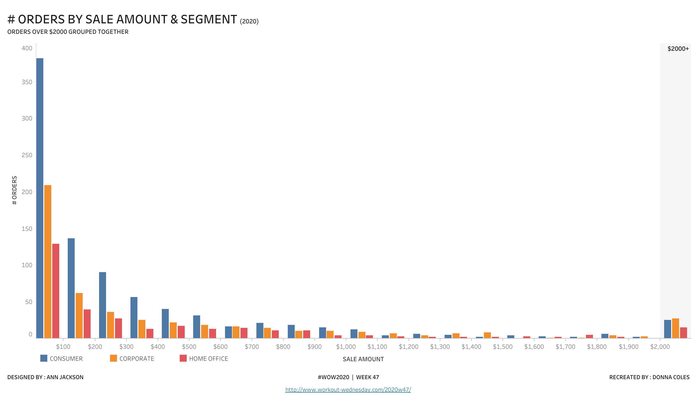
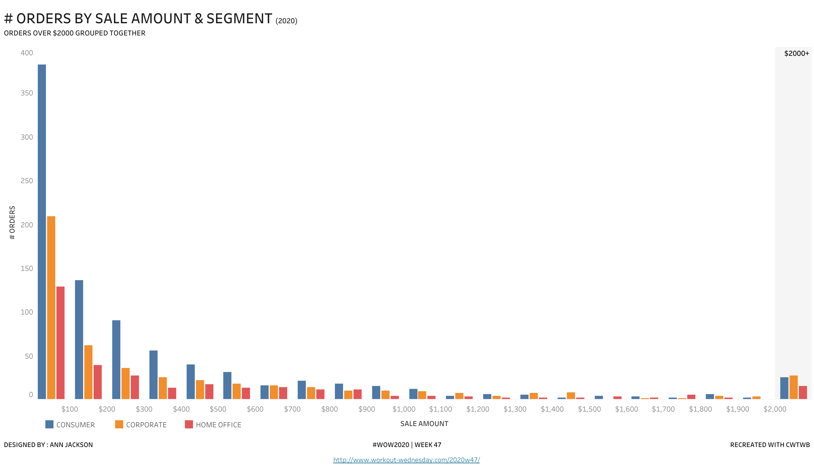
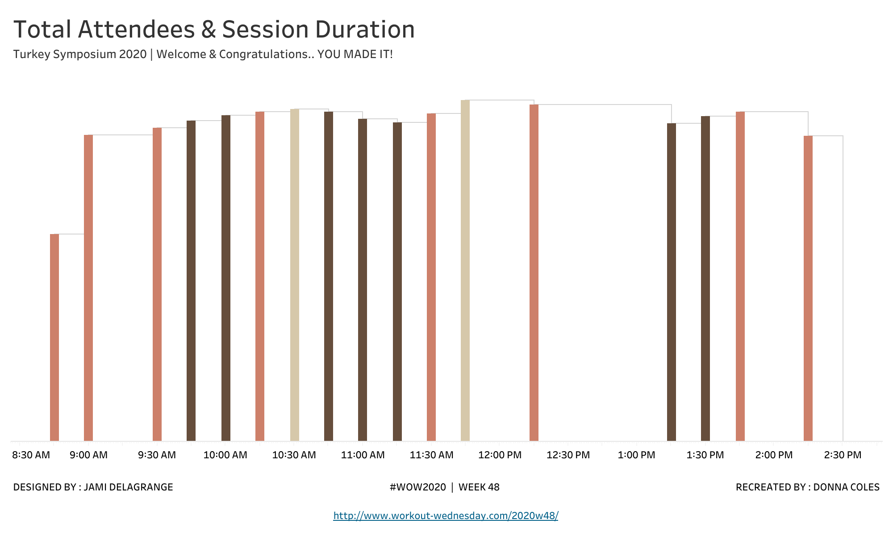
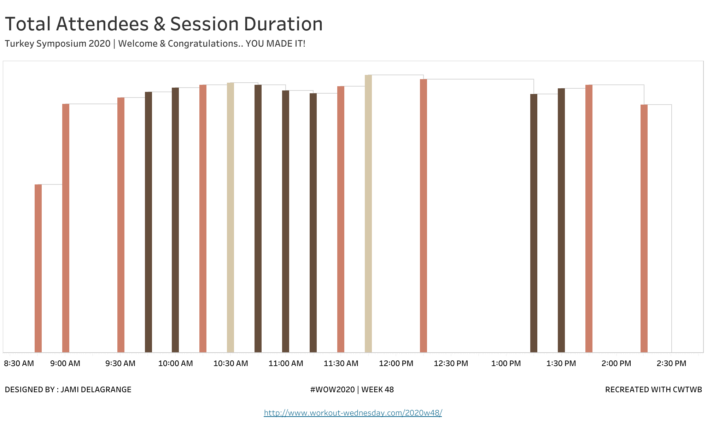
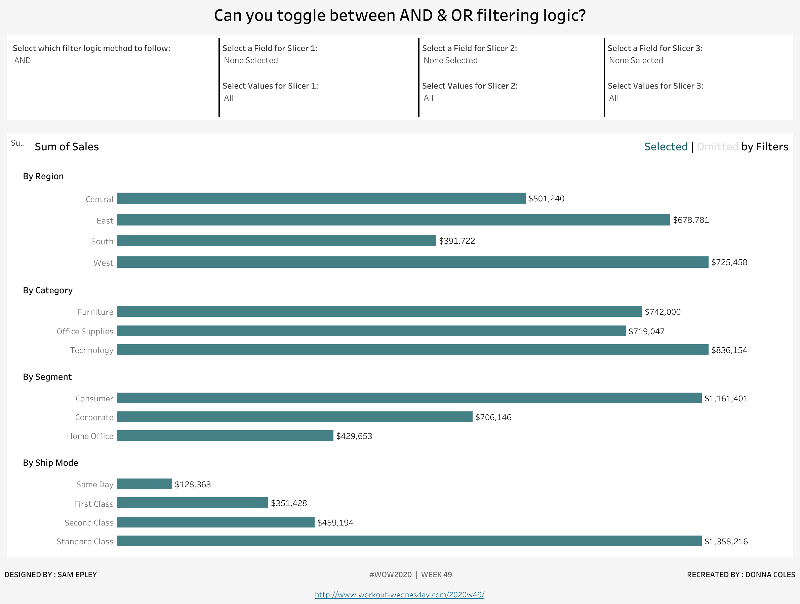
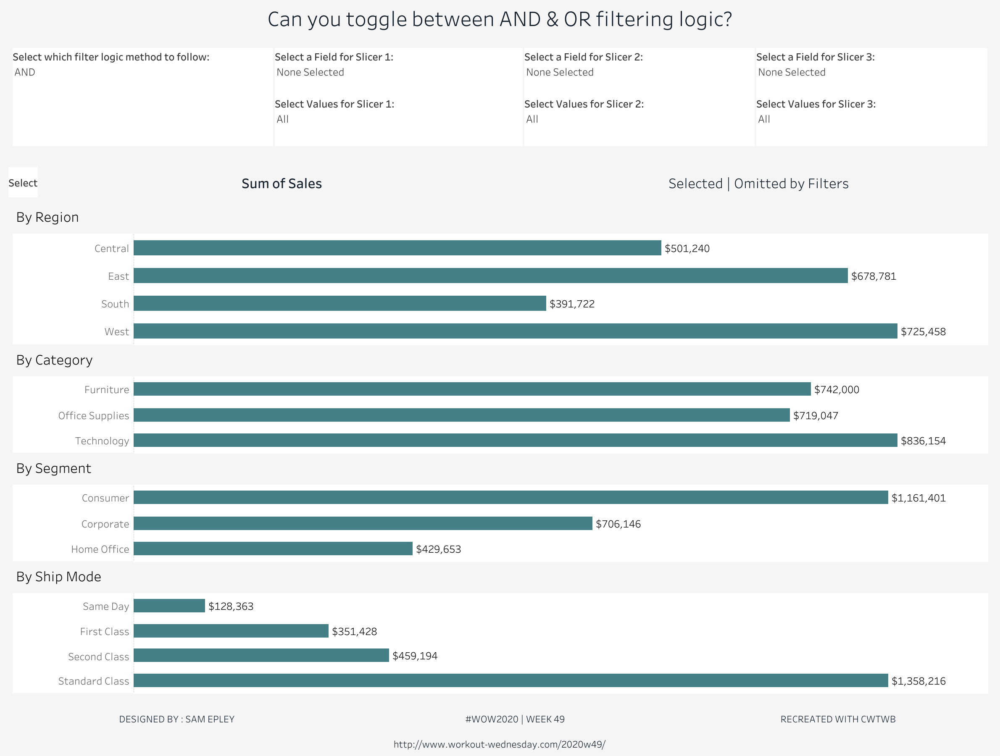
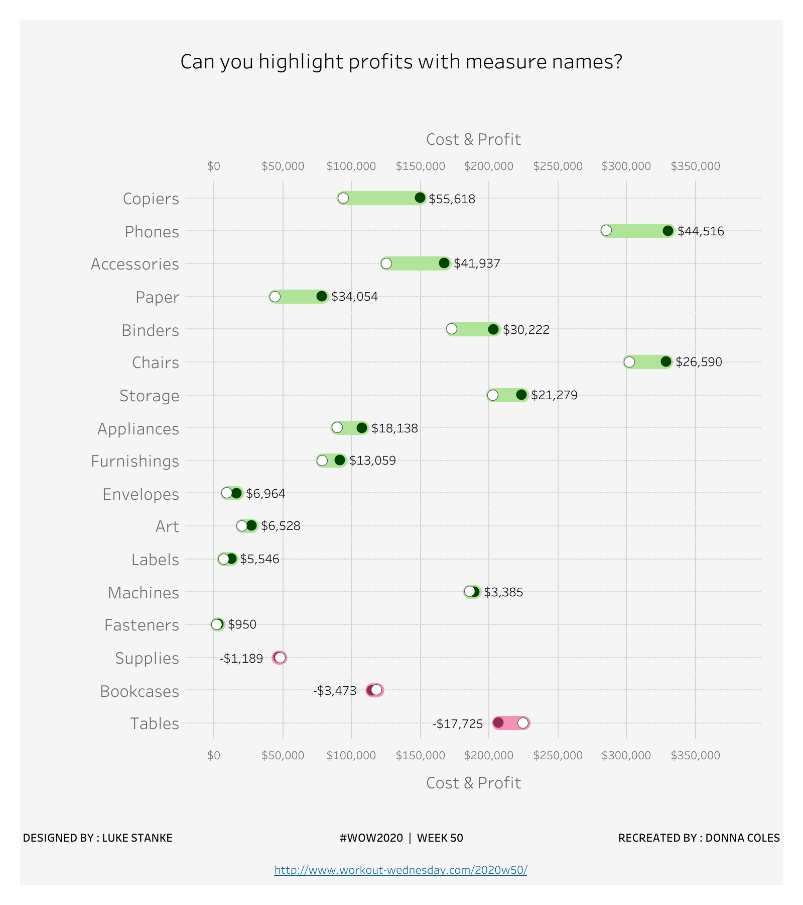
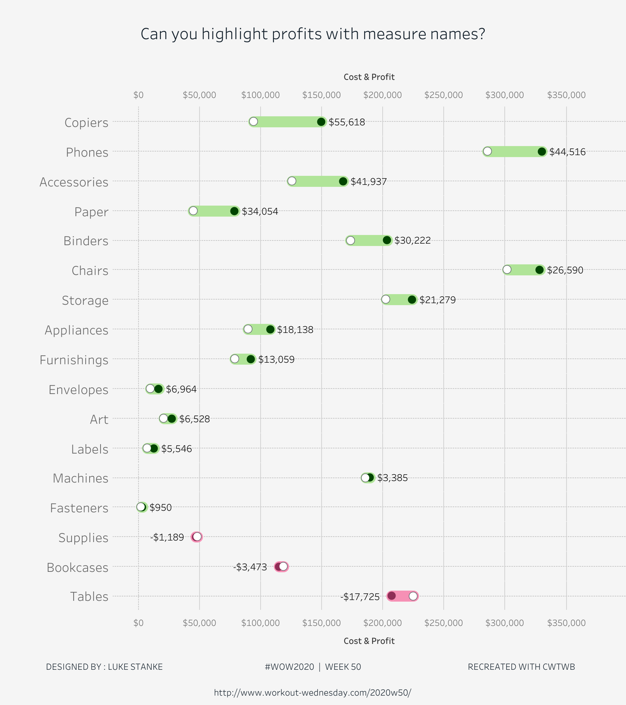
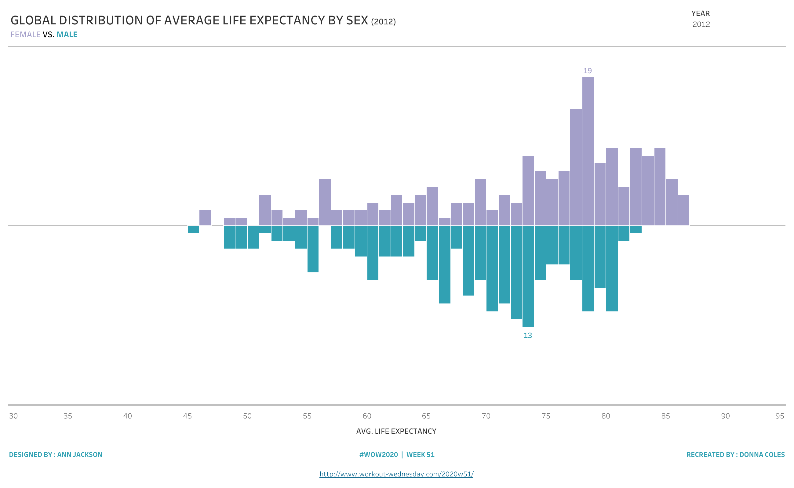
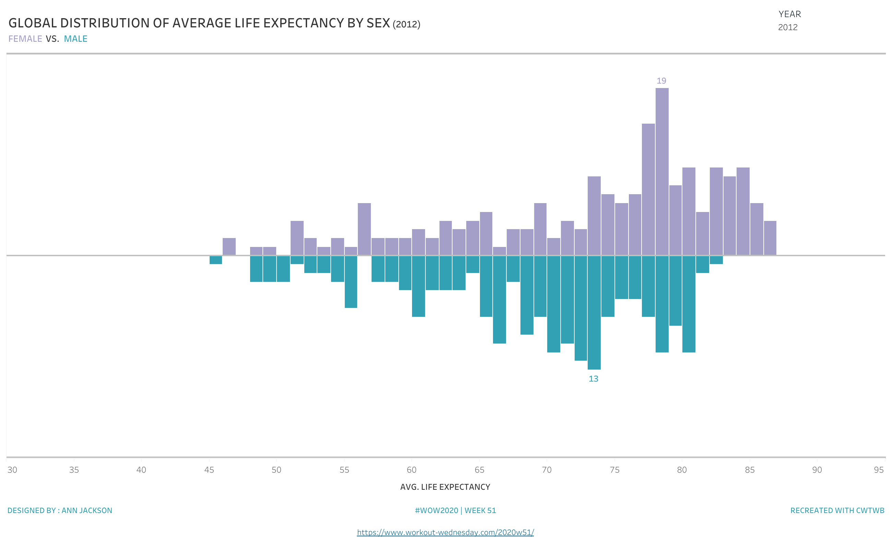

# 2020 WW47-51 Cloud review

This batch selects the five earliest unconsumed Donna Coles articles after WW46. Article dates are 2020-11-20, 2020-11-27, 2020-12-04, 2020-12-11 and 2020-12-18; official WordPress REST challenge dates are 2020-11-17, 2020-11-25, 2020-12-01, 2020-12-08 and 2020-12-16. Official IDs 4082 / 4092 / 4103 / 4110 / 4174 are retained per case.

Each builder starts with `TWBEditor("")` and reads locked extracted data through public high-level SDK APIs. Author workbooks are analyzed and independently published for comparison; builders never read them. Isolated audits remove all author TWB/TWBX files before reconstruction. Acceptance uses Cloud REST images/data states plus native artifact contracts; browser clicks, set selections, actions and hover execution are not claimed.

## Batch acceptance

All five cases are `replicated / acceptable_delta`. Functional/native layouts and full declared data-state coverage are accepted; the documented small visual differences prevent a pixel-identical claim.

| Case | Article | Main data scope | States | Evidence |
| --- | --- | --- | --- | --- |
| WW47 clustered histogram | 2020-11-20 | 3312 facts, 1687 distinct orders, 61 nonempty bin/segment groups | default, Consumer, Corporate | [Case evidence](../iterations/2020-11-20-ww47-clustered-histogram/evidence/visual-review.md) |
| WW48 variable width bar | 2020-11-27 | 94333 attendance facts, 17 sessions including two null-location breaks | default, Live, Recording | [Case evidence](../iterations/2020-11-27-ww48-variable-width-bar/evidence/visual-review.md) |
| WW49 AND/OR filtering | 2020-12-04 | 9994 facts, every Region/Category/Segment/Ship Mode metric | default, Quantity OR, Orders AND, Region/Category OR | [Case evidence](../iterations/2020-12-04-ww49-and-or-filtering/evidence/visual-review.md) |
| WW50 profit Measure Names | 2020-12-11 | 9994 facts, 17 subcategories, independent sales/cost/profit values | default, 16-subcategory partition, one-subcategory partition, Furniture, negative-profit subcategories | [Case evidence](../iterations/2020-12-11-ww50-profit-measure-names/evidence/visual-review.md) |
| WW51 divergent histogram | 2020-12-18 | Independent country/year female and male longevity buckets and table-calculation references | default 2012, 2011, 2000, 2001 | [Case evidence](../iterations/2020-12-18-ww51-divergent-histogram/evidence/visual-review.md) |

## SDK closure

Released baseline SDK e7fa7cd cannot author a native paired constant reference band or the needed field-backed compound categorical color encoding. Actual released failures are retained in case evidence. SDK e977401d862f0754ba610249e6720d61058ebdea introduces the native band and compound palette; final SDK df8c2a52cd48800fa0a43d936f6946d318f5b953 additionally restores the WW49 source-style `checkdropdown` multi-select filters with an explicit Apply button. These are generic public capabilities with author-free synthetic regression tests: 844 tests passed, 25 skipped. Multi-select submission is an artifact contract; no browser click is claimed. [Final SDK CI](https://github.com/aidatacooper/cwtwb/actions/runs/37204712666) passed. WW47, WW48 and WW51 retain their accepted artifact identities while isolated builds establish compatibility with the final Git dependency. Case calls do not access private SDK members or generate XML.

WW47 uses the native 2000-2100 filled band; its placement and actual Cloud rendering are reviewed, rather than treating XML as proof of visual correctness. WW50 uses native compound category palette buckets to keep sales/cost marker roles and profit coloring meaningful.

## Individual coverage and differences

WW47: six full Chart CSV exports cover 61 / 21 / 20 groups per role. Independent order totals and CountD group membership are checked for every order, including all three high-value groups. Initial Cloud review found the band label at the bottom and a static palette mismatch in Corporate-only filtering. Both were corrected using public APIs: final paired review confirms the rendered gray band with top black bold label and native Corporate-only blue palette reindexing. All six CSVs pass every group/position/count and all source conditional tooltip values. Remaining deltas are small title/plot offsets, font/legend spacing and truthful SDK credit. Accepted as `acceptable_delta`.

WW48: twelve CSVs cover Viz 34 / 16 / 14 rows and Data 51 / 24 / 21 rows per role. Each session has two checked pane heights and one checked duration-width proportion. The default retains both break sessions. Refined native reversal restores colored foreground strips, actual automatic time domain, 15-minute ticks, hidden attendee axes and the source's 1000x600 title/body/footer geometry. Remaining deltas are faint plot border, small offsets, tight default tick spacing and truthful SDK credit. Original Recording-state REST rendering omits title/footer while the replica retains them. Source `Break` alias normalizes to raw null in replica exports. Tooltip formatting/buttons differ at artifact level; no hover rendering is claimed. Accepted as `acceptable_delta`.

WW51: all 5382 locked raw records across 13 years are independently checked. Eight complete Viz CSV exports contain 74 / 77 / 80 / 76 rows per role for default 2012 / 2011 / 2000 / 2001, totaling 614 age/sex rows. Every distinct-country count and reference value is checked. Female/male peak counts are 19/13, 21/14, 18/13 and 14/15. All eight paired PNGs were reviewed by the case agent; purple/teal divergent marks, readable peak labels, dynamic year heading, YEAR control, hidden count axis and continuous 30-95 age axis are present. The source auxiliary Data worksheet's default 2011 is not evidence for the default 2012 visualization. Formatted male CSV counts may be unsigned: signed native conditional COUNTD and paired rendering establish divergence. The source's WINDOW_MAX of signed counts returns the female peak, so 2001 reference values +14/-14 are smaller than the male peak 15; all marks remain visible, with a slight baseline offset. The same reference-domain condition in 2002/2005 has raw mathematical coverage only. Small frame/typography/offset/credit differences remain. Accepted as `acceptable_delta`.

WW49: all 9994 raw facts and 32 complete business CSVs are independently verified. The four parameter states each contain all 14 Region/Category/Segment/Ship Mode groups with correct Sales/Quantity/Orders values and currency prefixes. All eight paired REST images were reviewed by the case agent; native checkbox multi-select dropdowns and Apply semantics are present as closed-state artifact contracts. Actual Cloud states use stored all-domain sets. A separate 64-scenario active/member truth table and raw subset oracle verify AND/OR expressions without claiming that browser subset-selection events were executed. Remaining deltas are grey section/title bands versus the source white panel, centered metric heading, one-color Selected/Omitted heading, control-divider/type/footer differences and source Region count labels ending .0 versus integer replica labels. Accepted as `acceptable_delta` on final Git df8.

WW50: the final default images retain the source dot/line layout, rings, compound sales/cost colors, profit direction and currency axis. Five final Cloud states provide 20 CSVs and 10 PNGs. Author default Data CSV covers all 17 subcategories (51 metric rows), but author default Viz CSV covers only Copiers (6 layer/measure rows), while the replica default Viz CSV covers all 17 (102 rows). This limitation is explicit: default author Viz CSV does not establish complete chart data. Actual REST partition states cover 16 and one subcategories respectively, yielding 96 and 6 Viz rows in both roles; together they independently cover all 17 plotted subcategories. Furniture covers four subcategories (12 Data / 24 Viz rows per role), and negative-profit filtering covers three (9 Data / 18 Viz rows per role). Earlier incomplete all-state and 8/9-partition captures are retained as rejected diagnostic evidence and excluded from final acceptance. All 20 CSVs and 10 hash-bound paired PNGs pass the final case-agent review. Descending profit order, pale green/pink lines, dark Sales endpoints, white Cost centers with grey rims, positive right labels, negative left labels and synchronized $50,000-style currency axes agree. Remaining deltas are plot padding, row spacing, Cost & Profit title typography, outer white margins, footer alignment and hyperlink styling. Primary Measure Values use tolerance 0.000001; formatted currency labels/tooltips use 0.51. Two-pane repetitions are verified native rows, not extra business cells. Accepted as `acceptable_delta`.

## Default image comparisons

The default image pair is supplemented by every declared parameter/filter state above. WW50 full chart CSV completeness is established by the two explicit partition states, not its author default Viz CSV.

| Case | Author | Replica |
| --- | --- | --- |
| WW47 |  |  |
| WW48 |  |  |
| WW49 |  |  |
| WW50 |  |  |
| WW51 |  |  |

## Artifact binding

- WW47: `2ab41510854c76f3f43b520b79e2b997ee443e19502a26b2ac55b30ff048c6e8`; capture replica hash `2ab41510854c76f3f43b520b79e2b997ee443e19502a26b2ac55b30ff048c6e8`.
- WW48: `90fcf9ff916639a44c0663f781ab194a91855e6b937ae7cb77e7630a70540b01`; capture replica hash `90fcf9ff916639a44c0663f781ab194a91855e6b937ae7cb77e7630a70540b01`.
- WW49: `f352bf10b9b9795aa4f87a27008146559f743b31d10c9c6abda4e3d435fb0d9f`; fresh four-state capture is bound to this artifact.
- WW50: `aacc4eb90acb5a94cf8abc634bda660e1ee784e93ae06807e3c55b79e44186e8`; fresh five-state capture is bound to this artifact.
- WW51: `2f76d2a090b5544cd9d840192296f3b50fba0faf7e201c99fd7f576592c635cf`; fresh four-state capture is bound to this artifact.

Independent manifest verification confirms 19 final states, 38 PNGs and 78 CSVs. Every captured file hash matches its manifest and every replica manifest hash matches its frozen TWBX. The individual visual reviews and strict raw-data/native-contract reports establish final acceptance. Final repository validation passed: 60 shared tests, all 79 active cases with metadata-only validation, all five frozen-artifact verifiers, and all five isolated empty-workbook builds on the final Git SDK. The catalogue was regenerated, the ten builder/verifier files pass formatting checks, and staged bytes preserve every validated hash binding.
