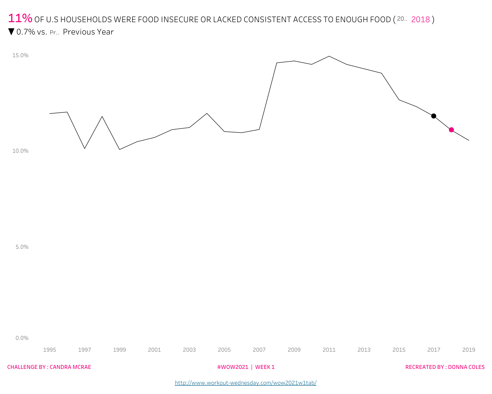
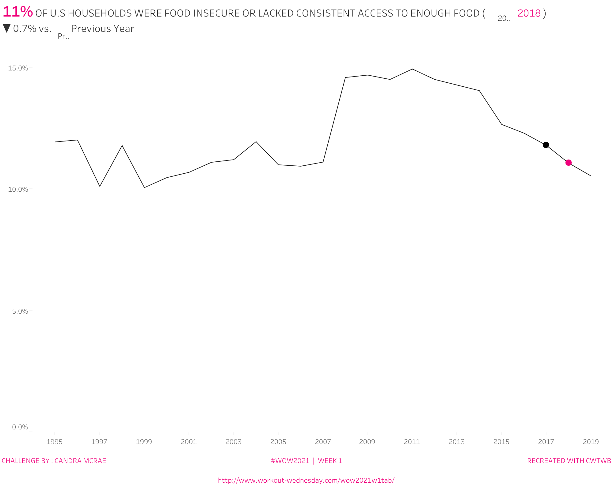
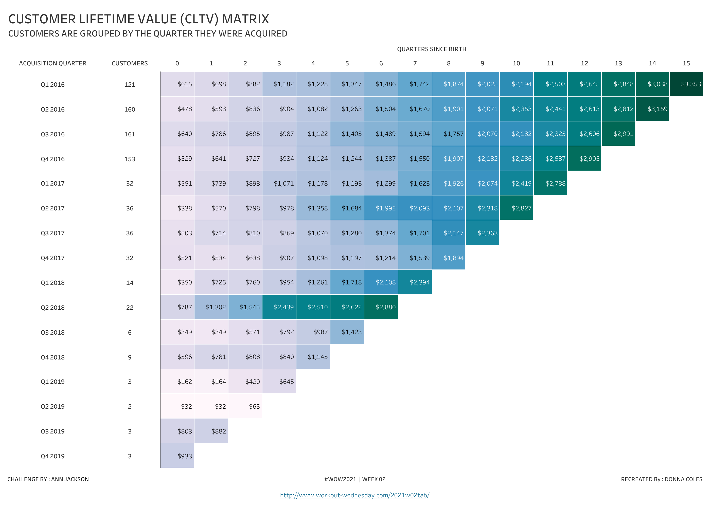
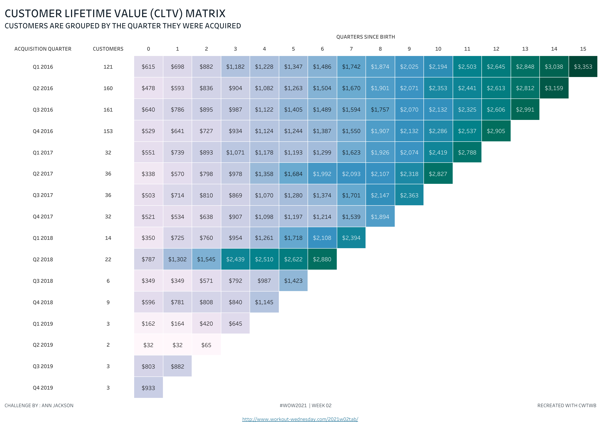
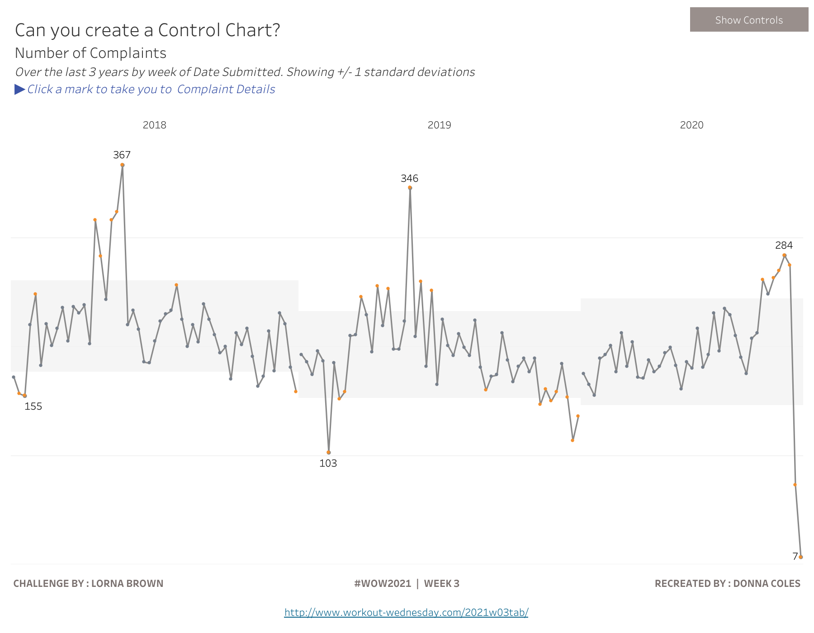
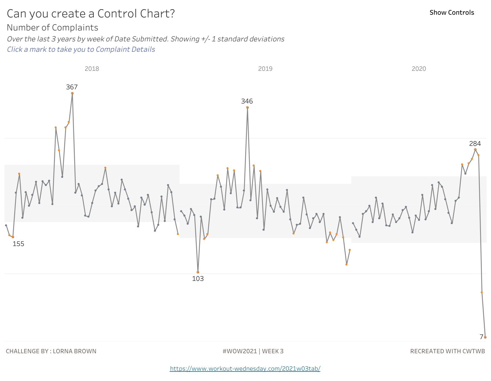

# 2021 WW01-03 Cloud review

This batch selects the three earliest unconsumed articles with author workbooks from the complete article index. The preceding 79 formal cases are excluded by article identity. All three builders start with `TWBEditor("")` and use public SDK APIs with locked extracted inputs. Author workbooks are used only for analysis, extracted data and separately published Cloud comparisons.

| Case | Article date | Official challenge date | Business behavior |
| --- | --- | --- | --- |
| [2021 WW01](../iterations/2021-01-08-ww01-line-variance/) | 2021-01-08 | 2021-01-05 | Food insecurity trend, selected year, three comparison modes and percentage-point change |
| [2021 WW02](../iterations/2021-01-14-ww02-customer-lifetime-matrix/) | 2021-01-14 | 2021-01-12 | Customer lifetime value matrix |
| [2021 WW03](../iterations/2021-01-22-ww03-control-chart/) | 2021-01-22 | 2021-01-19 | Control chart and statistical thresholds |

Official challenge dates are actual WordPress `date` fields, retained separately from article publication dates. Year and week are identity fields.

Acceptance uses Cloud REST images/data at explicit parameter or filter states plus native workbook contracts. Browser clicks, parameter selections, hovering and mobile interaction are not claimed. `acceptable_delta` means the documented functional/layout scope passes with specified visual differences; it does not mean pixel identity.

WW01 independently checks all 25 annual facts and 75 year/comparison oracle combinations. Six actual REST states include default 2018 Previous Year, First Year, Most Recent Year, the missing 1995 Previous Year boundary, the zero-change 1995 First Year boundary, and a positive 2011 First Year difference. Native nested WINDOW_MIN/MAX calculations remain in the trend and diagnostic Data sheets. A separate Text worksheet supplies an equivalent dynamic header. Complete worksheet exports, rather than controls or buttons, provide business-data coverage.

The three final artifacts use the actual, noneditable Git SDK installation `fe9f33b4dfbe5b1ecec7c56d41138a2888971375` (0.27.1). Its regression suite passed 876 tests with 25 skips, and [SDK CI passed](https://github.com/aidatacooper/cwtwb/actions/runs/37214079853). Authorless isolated rebuilds begin with zero TWB/TWBX files and use extracted inputs only; their independent native/raw verifiers and repository iteration validators pass without rebuilding the frozen formal artifacts.

The primary acceptance covers **11 REST states, 22 PNGs and 42 CSVs**. Two additional WW03 default Detail PNGs and two empty Detail CSVs bring the committed evidence to **24 PNGs and 44 CSVs**. The additional Detail evidence shows the default, unselected dashboard only; its empty CSVs cannot establish selection-driven drilling or browser action execution.

| Case | Frozen workbook SHA-256 | Primary states | Primary PNG / CSV |
| --- | --- | --- | --- |
| WW01 | `0277a239831ed22cf3d41c311a906ba671294525faeaf1332bd632210944e42a` | 6 | 12 / 24 |
| WW02 | `28376408fa2c1fc8d9db584ae908915d6fb01192b9ecf452623d7ff28b067c8f` | 1 | 2 / 2 |
| WW03 | `55fc9aaeb2913767cceefc73117eb3cf716bd0759fd2f03f14a7edbf1479f58a` | 4 | 8 / 16 |

WW01's complete Viz exports each cover 25 years across three mark layers (75 rows); its complete Data exports each cover 25 years and ten measures (250 cells). These include missing and zero boundary values. Exact diagnostic values and display-precision tolerances for formatted Viz values are tested separately. Accepted differences are the comparison/year native-control text baselines, small plot/title/font/footer offsets, and omission of the original's literal `None` in a null-difference heading. Selected years and signs remain visible and numerically correct. See the [full six-state review](../iterations/2021-01-08-ww01-line-variance/evidence/visual-review.md) and [functional evidence](../iterations/2021-01-08-ww01-line-variance/evidence/functional-verification.json).

WW02: both default Viz CSVs cover the full 136-cell triangular matrix, checked against 9,994 original order lines, 793 customers, 16 acquisition cohorts, 134 observed quarter/cohort sales cells and two isolated internal missing-sales gaps. Missing cells retain the preceding cumulative average only where the original LOOKUP immediate-neighbor rule applies. Trailing out-of-domain nulls remain absent. Zero-decimal dollar formatting is validated within its stated rounding precision. The desktop matrix preserves headers, cohort counts, cell ordering, borders and the nine-stop purple/blue/green progression; minor title/top spacing, cell-height, typography and interpolation differences are documented. No author auxiliary table or button CSV is used as whole-matrix proof.

WW03: 75,513 unique original consumer complaints drive Monday-based weekly counts. Four REST states cover Submitted/default three years and one standard deviation, Received three years/one deviation, Submitted one year/two deviations, and Received five years/three deviations. Complete raw weekly domains have 146, 146, 41 and 250 marks. Each role exports Chart and diagnostic Data for every state. The original Data worksheet densifies year/date combinations, so null-count cross-year cells are disclosed; numeric window limits are independently checked within their actual scope.

The original control chart has a calculation-context limitation: its gray band uses a per-year mean and sample deviation, while its circle classification uses a mean across all visible weeks and a per-year deviation. Classification and band scopes therefore disagree for 12, 17, 0 and 3 weeks respectively across the four tested states. This source behavior is preserved and documented in [source classification context](../iterations/2021-01-22-ww03-control-chart/evidence/source-classification-context.json); an orange mark is not promised always to lie outside the displayed gray band. Native parameter-panel show/hide, detail filtering on selection/clear-none, Back navigation and highlight contracts are inspected as workbook artifacts. No browser event execution is claimed.

WW03 retains minor title/plot spacing and font differences. Its Show Controls button uses dark text without the original gray background, and the instruction omits the decorative triangle. The default Detail page preserves the empty selection, dynamic title and upper-right gray Back button, with minor typography differences. The replica footer identifies SDK construction.

The reusable SDK changes came from WW03: field-backed reference-band endpoints and explicit dashboard action/show-hide contracts. WW01 and WW02 reuse existing APIs; the refinements to title rendering, native addressing contexts and complete worksheet export bindings are case usage improvements.

| Default dashboard | Author | Replica |
| --- | --- | --- |
| WW01 |  |  |
| WW02 |  |  |
| WW03 |  |  |

Detailed per-case scope and visual differences are retained in the [WW01 review](../iterations/2021-01-08-ww01-line-variance/evidence/visual-review.md), [WW02 review](../iterations/2021-01-14-ww02-customer-lifetime-matrix/evidence/visual-review.md) and [WW03 review](../iterations/2021-01-22-ww03-control-chart/evidence/visual-review.md). These screenshots establish the stated desktop layout scope, with documented deltas rather than pixel identity.
