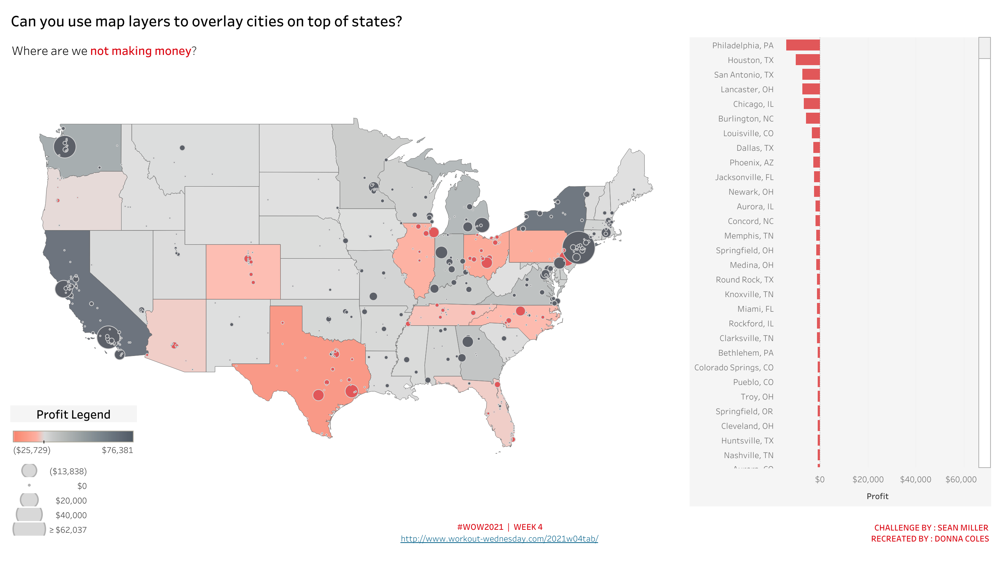
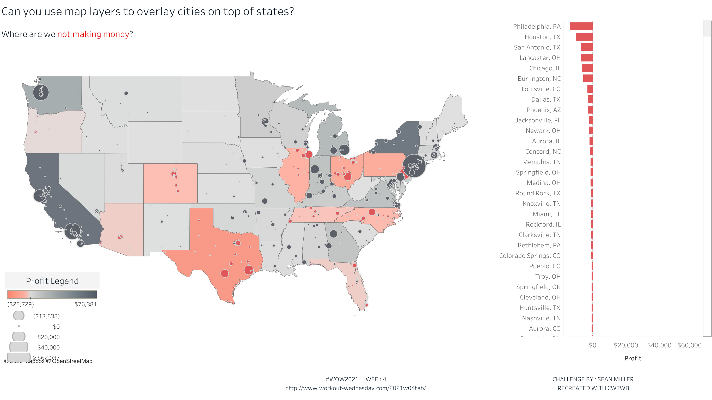
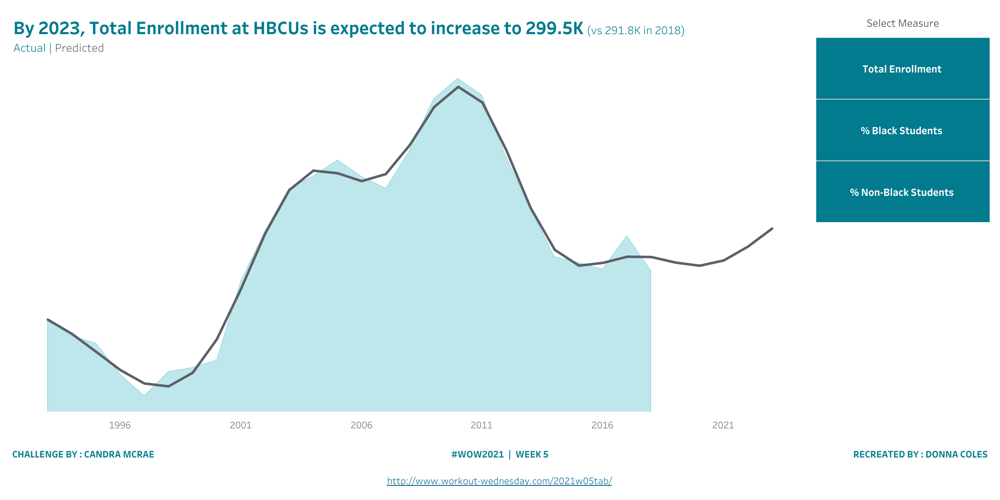
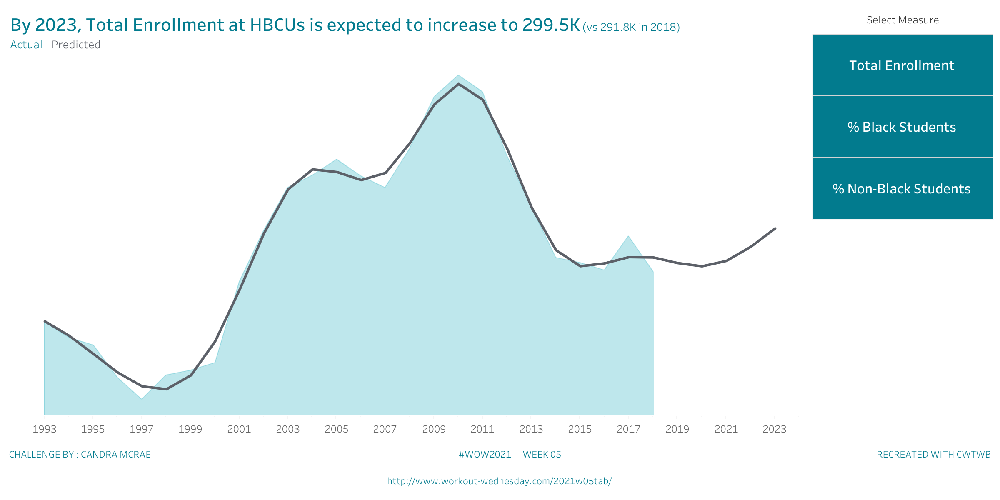
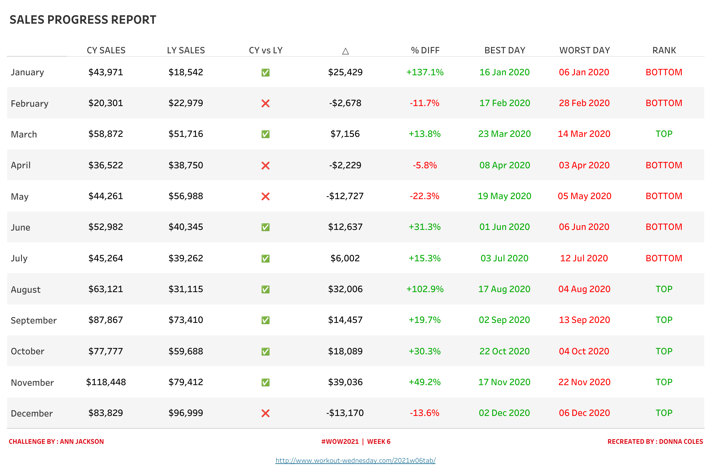
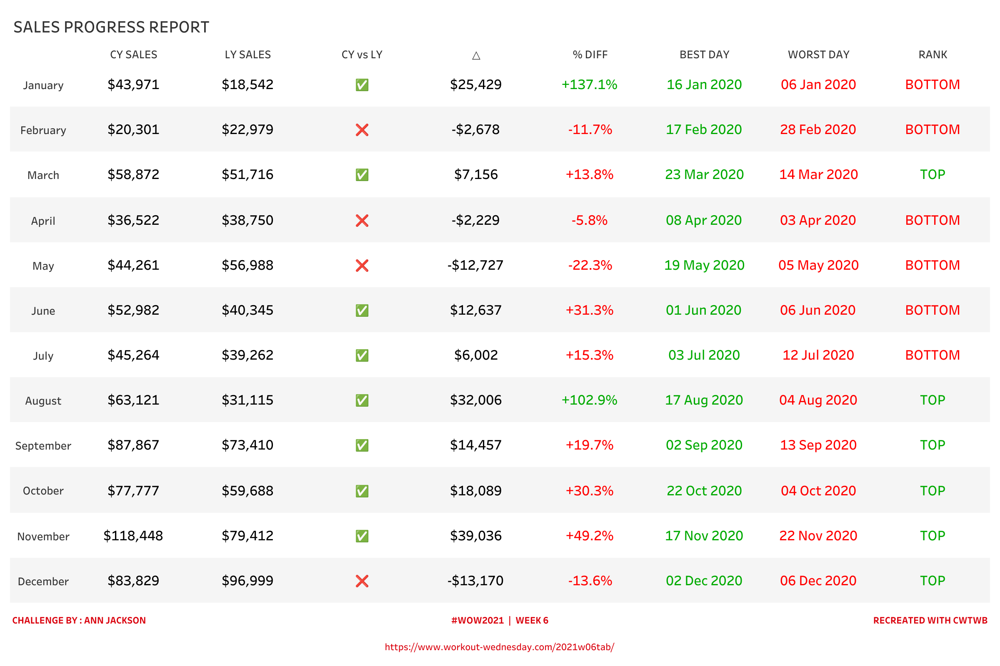
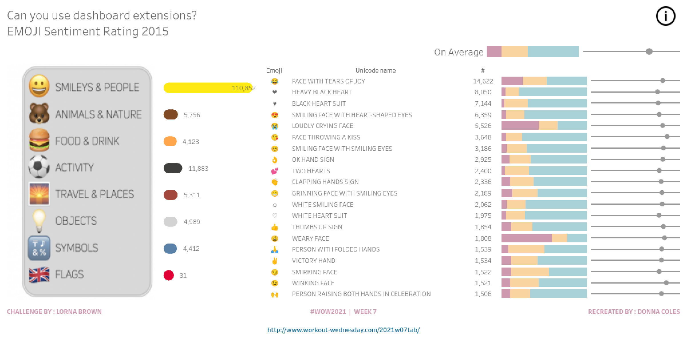
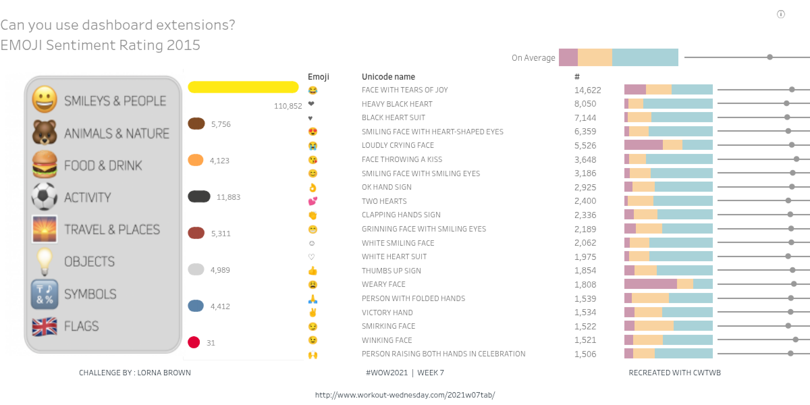
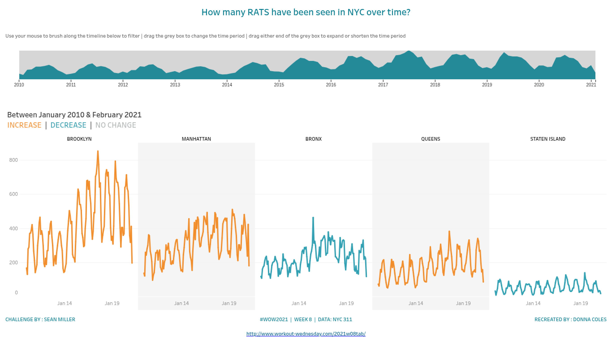
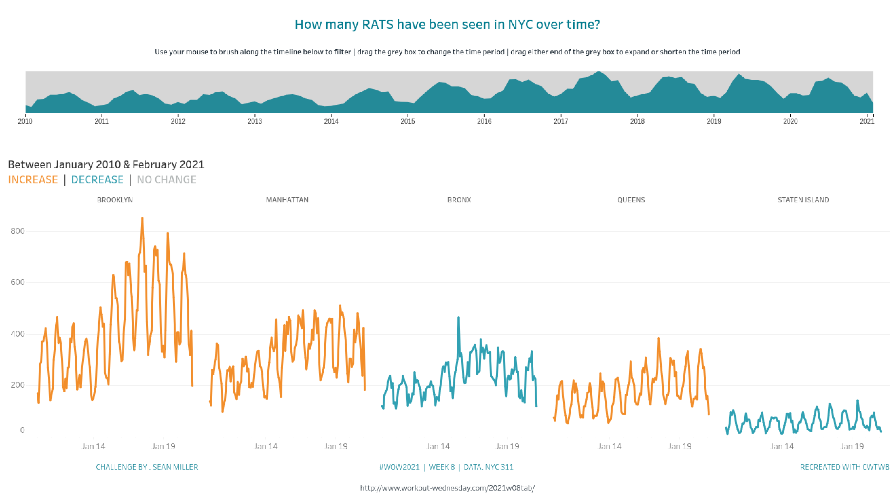

# 2021 WW04–08 Cloud review

All five cases are `replicated / acceptable_delta`, accepted within the
declared Cloud REST and artifact scope. Final evidence contains 10 requested
states, 20 PNG exports and 34 complete worksheet CSV exports across author and
replica roles. Minor visual differences remain documented per case.

The locked SDK is [`e076cd0`](https://github.com/aidatacooper/cwtwb/commit/e076cd03021f39a95b23646f45f7f912733be69c),
with 931 tests passing and 25 skipped; its [CI passed](https://github.com/aidatacooper/cwtwb/actions/runs/37218042407).
All five builders also passed isolated reconstruction on that exact noneditable
Git dependency with no initial workbooks. The accepted WW04/05/06/08 artifacts
retain their actual `85643b0` build provenance and Cloud hash bindings; WW07 was
built with `e076cd0`. Compatibility checks do not replace captured artifacts.
The case repository's 60 shared tests and all five disposable case validators
passed. The formal catalogue now contains 87 cases.

The five cases are the earliest unconsumed articles following the preceding
formal catalogue. Every builder starts with `TWBEditor("")` and uses public SDK
APIs with locked inputs. Author workbooks supply analysis, extracted data and
separately published comparisons; they are never builder templates. Source
comparison preparation changes worksheet-window visibility for REST exports,
with its mutation scope and hashes recorded separately.

| Case | Article date | Official challenge date | Business behavior |
| --- | --- | --- | --- |
| [2021 WW04](../iterations/2021-01-28-ww04-map-layers/) | 2021-01-28 | 2021-01-26 | State profit polygons, city profit circles and sorted city bars |
| [2021 WW05](../iterations/2021-02-04-ww05-predicting-the-future/) | 2021-02-04 | 2021-02-02 | Enrollment actuals and native Gaussian-process future predictions |
| [2021 WW06](../iterations/2021-02-11-ww06-fancy-text-table/) | 2021-02-11 | 2021-02-10 | Monthly sales, comparison symbols, daily extrema and rank |
| [2021 WW07](../iterations/2021-02-18-ww07-emoji-sentiment-rating/) | 2021-02-18 | 2021-02-16 | Emoji sentiment with the real Image Map Filter extension |
| [2021 WW08](../iterations/2021-02-25-ww08-brush-filter-extension/) | 2021-02-25 | 2021-02-23 | Borough sighting trends with the real Brush Filter extension |

WW06's official publication was Wednesday, rather than an assumed Tuesday.
WW07's original official title contains a 2020 typo; the official slug, article
and workbook establish 2021 WW07, and the source title is retained in evidence.
Only `article_date` and `challenge_date` are business identity dates.

| Case | Requested REST states | CSV scope | Artifact-only interaction checks |
| --- | --- | --- | --- |
| WW04 | Default | Complete Map state/city domains and complete Bar city/state domain for each role | Inert state layer, city tooltip and bar-to-map highlight with auto-clear |
| WW05 | Total enrollment, Black share, non-Black share | Entire Chart training/future domain and both overlapping panes for each role | Native selector parameter action, ATTR aggregation and retain-on-clear |
| WW06 | Default | Complete monthly Measure Names/Values table for each role | Numeric display formats, independent color domains and tooltip suppression; no source actions |
| WW07 | Default, Animals & Nature, Flags | Complete Top 20, category totals and average views for each role, within each recorded effective state | Real extension manifest, settings, image regions, resources and Top 20 target |
| WW08 | Default, exclude-Brooklyn override | Complete visible borough/month trend for each role, within the effective source filter domain | Real extension identity, axis references, worksheet binding and exclusive-filter semantics |

The final manifests record requested image and CSV parameters/filters, view
identities and file hashes. WW05's three parameter states visibly change both
the dashboard and worksheet data. WW07 and WW08 dashboard images retain their
default state despite the requested category/Borough overrides; their filtered
worksheet CSV exports prove data responses, while PNGs prove default layout
and real extension rendering. No filtered dashboard visual response or browser
click, hover, drag or clearing execution is claimed.

WW04 rebuilds a state choropleth beneath signed-profit city circles, with bar
sorting by profit and a shared United States geocoding context. Duplicate city
names are distinguished by state. An independent raw-order oracle supplies
every state and city profit, and the analysis-extracted abbreviation input
supplies explicit state identities. The state layer is inert while city marks
retain signed tooltips; bar hover highlights City plus State Abbrev, with
native automatic clearing. Full Map and Bar CSV domains must be checked,
including each export's actual rounding precision. Visual review covers layer
alignment, circle size/sign encoding, bar ordering, title and legends. Early
candidate ordering, subtitle and legend issues were corrected through public
usage; only the final paired renders determine the accepted residual deltas.
See the [case analysis](../iterations/2021-01-28-ww04-map-layers/analysis.md).

WW05 uses original annual enrollment observations and a public measure
parameter to switch among total enrollment and the two student shares. Actual
values and ratios are independently computed from raw input. Future median
predictions use Tableau's native `MODEL_QUANTILE('model=gp', ...)`; the date
domain extends beyond the last training year and enables calculations on
densified marks. Future actuals remain null. Whole-chart CSV checks must
distinguish the two identical pane exports, compare the complete future and
training prediction domain with the separately published source, and verify
scaling, residual arithmetic and title endpoint/direction values. Tableau fits
the Gaussian-process model: this work does not claim an independently
implemented GP fitting oracle. The selector CSV is not proof of future values.
Visual review covers the area/line overlay, date extent, title, axis scale and
side selector for each parameter state. The native parameter action is a
contract check, not evidence of an actual click. See the
[case analysis](../iterations/2021-02-04-ww05-predicting-the-future/analysis.md).

WW06 is a single Measure Names/Values text table. Raw monthly sums establish
current/prior sales, comparison signs, monetary and percentage deltas. Raw
current-year daily totals independently establish best/worst observed dates,
with the latest date selected on ties; missing dates do not become zero-sales
candidates. Numeric date serials, comparison signs and rank values are checked
separately from their native displayed dates, symbols and TOP/BOTTOM formats.
Independent stepped color domains reproduce the published source, including
black monetary deltas and red/green percentages. Final full-table CSV
checks and paired renders passed with their recorded artifact hashes.
Entire-view fitting and footer alignment were
refined using existing public layout APIs. Residual differences are
title weight/top spacing, month-label alignment, small font/row-spacing
changes, SDK attribution and the HTTPS footer URL. See the
[case review](../iterations/2021-02-11-ww06-fancy-text-table/evidence/visual-review.md).

WW07 retains the two-table relationship between sentiment facts and emoji
dictionary entries, including unmatched emoji with null categories. The
default category totals and average exclude null categories. REST category
overrides replace that exclusive filter: they exclude the selected category
and reintroduce the 233 unmatched facts into these two worksheet domains.
Top 20 uses an inclusive category filter. All three scopes are independently
checked against raw relational data; dashboard PNGs remain at their default.
The
original category group combines People & Body with Smileys & Emotion. Category
context filtering precedes top-N selection, and a category with fewer matching
emoji correctly yields fewer than twenty marks. The raw relational oracle
checks occurrence totals, sentiment percentages and position values; category
totals and the average legend exclude null categories within their declared
scope. Average Position is unweighted by occurrence. Acceptance must check
each exported worksheet's effective state rather than assuming an extension
target filter applies to every view.

The dashboard uses the actual sandboxed Image Map Filter extension, retaining
its manifest, configured settings, category image, icon, eight image regions
and intended Top 20-only filter target. The category image and native extension
zone are not replaced with a parameter or substitute control. Public endpoint
availability and native configuration are separate from browser execution and
site/runtime policy. REST category-filter states do not prove that an image
region was clicked. Paired review must disclose the final export's actual
extension rendering, together with stacked bars, position circles, category
chart and legends. See the
[case analysis](../iterations/2021-02-18-ww07-emoji-sentiment-rating/analysis.md).

WW08 rebuilds the monthly borough trend from raw records. Every Created Date
is non-null, making the public date-count calculation equivalent to the
source's table-object row count. Endpoint calculations address months within
each borough; increase/decrease/no-change color classifications and the title
domain are checked separately. The actual Starschema Brush Filter extension
retains its structured manifest, runtime URL, settings, colors, month/count
axis references and worksheet-index binding. A reserved layout region contains
the real extension object rather than a native brush substitute.

The source Borough filter is exclusive. Its `Borough=BROOKLYN` REST override
excludes Brooklyn and changes the default exclusion domain; it must not be
reported as a Brooklyn-only state. The final verifier must assert the actual
resulting borough/month domain, including any Unspecified rows exposed by that
override, and check every count and endpoint classification. An inspected
upstream extension aggregation issue increments `priceee` for repeated dates,
while the brush overview consumes the original y-axis value. The overview can
therefore reflect the first summary-data borough rather than an independently
summed all-borough total. The complete chart CSV supplies numerical acceptance;
the extension overview is not proof of NYC totals. REST images and artifact
configuration do not demonstrate a mouse brush, selection or clearing event.
See the [case analysis](../iterations/2021-02-25-ww08-brush-filter-extension/analysis.md).

The reusable SDK work originates in WW04's inert map layer and signed-profit
size encoding, WW05's extended time-series domain and densified-mark
calculations, and WW07/WW08's structured dashboard extension authoring. WW08
also exposes the need to preserve exclusive categorical-filter metadata under
REST overrides. Synthetic regressions exercise these public capabilities
without author workbooks or data. WW06 uses existing APIs. The final SDK compatibility checks and per-case evidence distinguish original
build provenance, accepted Cloud artifacts and isolated rebuild outputs. No
pixel-equality conclusion is claimed.

| Case | Author render | SDK replica render |
| --- | --- | --- |
| WW04 |  |  |
| WW05 |  |  |
| WW06 |  |  |
| WW07 |  |  |
| WW08 |  |  |
