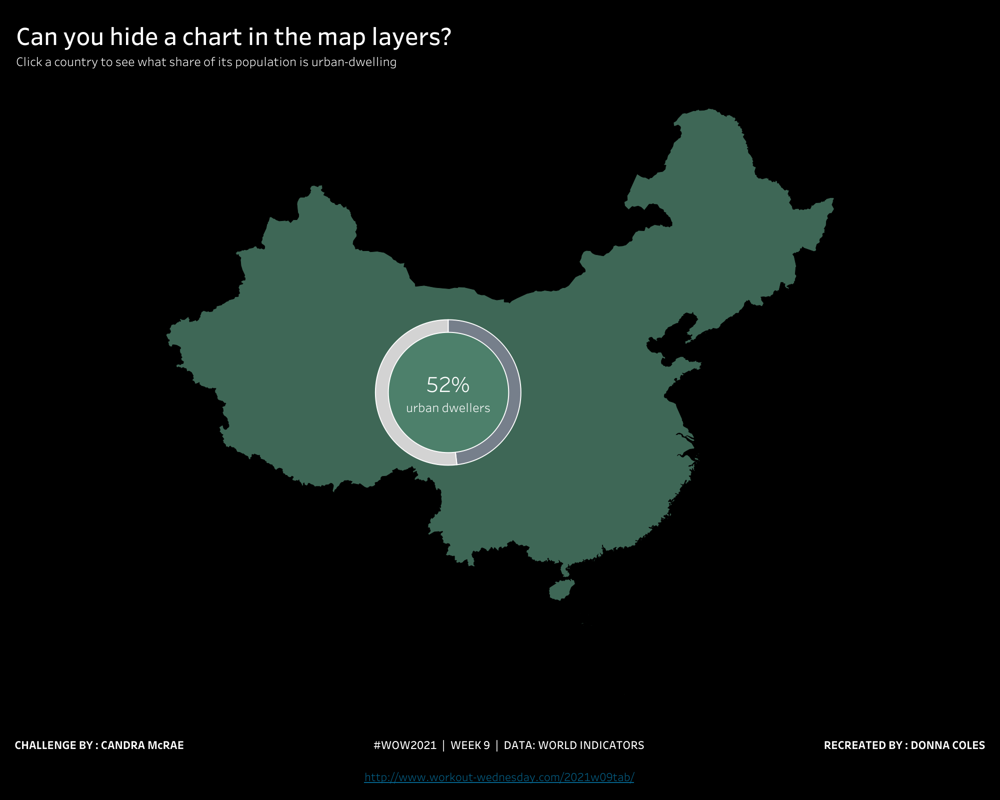
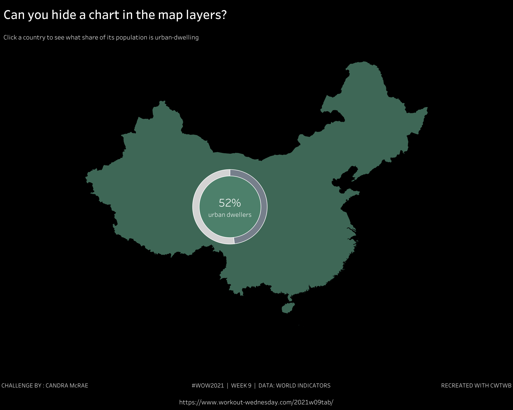
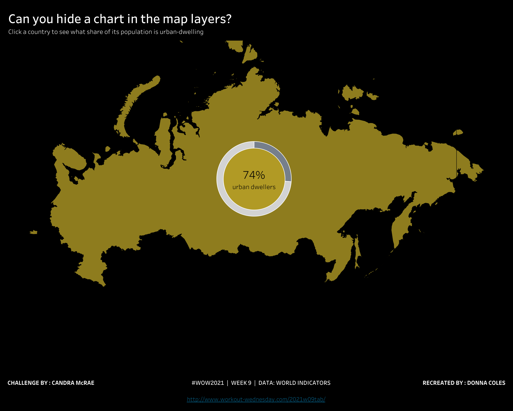
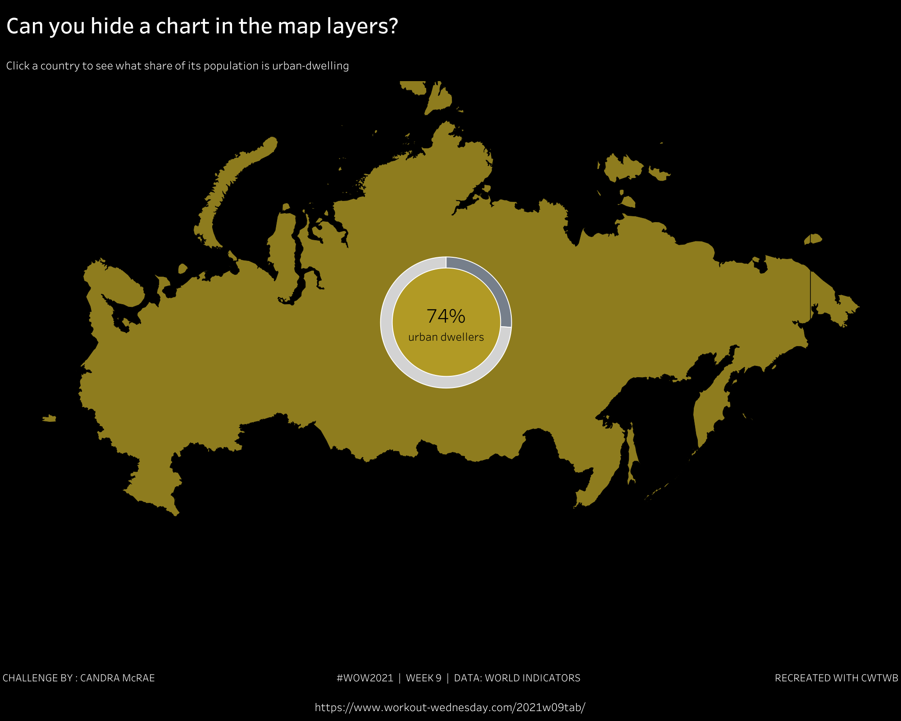
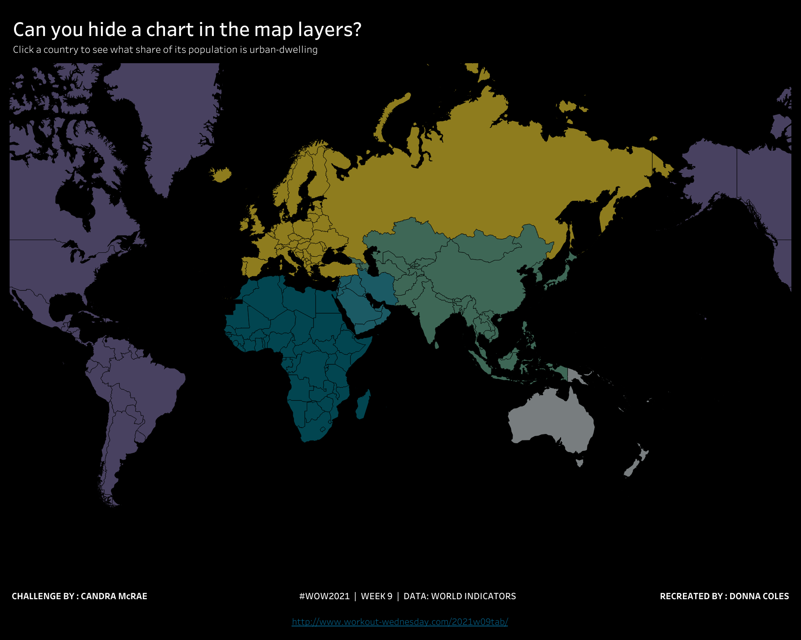

# 2021 WW09: hide a chart in map layers

The case is **replicated / acceptable_delta**. It is built from `TWBEditor("")`
using public SDK APIs and the locked Hyper input. An isolated build containing
only scripts, metadata and inputs passed without any author TWB or TWBX.

The case exposed a reusable SDK gap: native geographic layers needed independent
geography, Measure Names / Measure Values pie slices and per-layer palettes.
SDK commit `6f220236b58dc8a5de08ce9e2d298f5c085a95ec` adds these capabilities while
preserving the existing overlay mode. The case dependency pins that exact Git
commit. SDK tests: 944 passed, 25 skipped; SDK CI passed.

Cloud REST exports cover default, China, Russia and empty-parameter reset:
eight dashboard PNGs and eight complete Map worksheet CSVs. The donut is hidden
on the world map and appears inside the selected country with 52% for China and
74% for Russia. The ring label, background labels and title alignment were refined
after the first Cloud review. Small padding, footer and link styling differences
remain; this is not pixel-identical.

| State | Author | Replica |
| --- | --- | --- |
| World |  |  |
| China |  |  |
| Russia |  |  |
| Reset |  |  |

Independent validation reads all 2691 Hyper records (2000–2012, 207 countries per
year). The 2012 country domain has 207 keys, six regions and population
7,014,951,860; 205 urban ratios are known and two are null. Default/reset CSVs
retain the complete country domain. Selected states verify both exact pie shares,
including China 0.519 / 0.481 and Russia 0.738 / 0.262. Every NULL-geography region
and global summary row is checked independently instead of being discarded.

CSV population values are formatted to integer millions and tooltip percentages
to integer percent; their verification respects that precision. Exact population
counts and null semantics come from the independent Hyper oracle and calculations.
A complete data domain does not establish that every country is geocoded visibly.

Parameter REST states and workbook action contracts form the agreed acceptance
scope. The select action and empty-value clear behavior are checked in the output
artifact; browser selection and clearing were not executed. Evidence is bound to
the final workbook hash in the [case directory](../iterations/2021-03-04-ww09-hide-chart-map-layers/).
