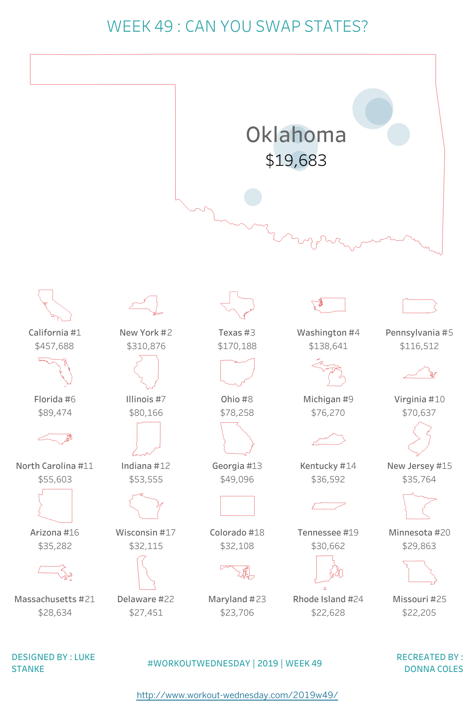
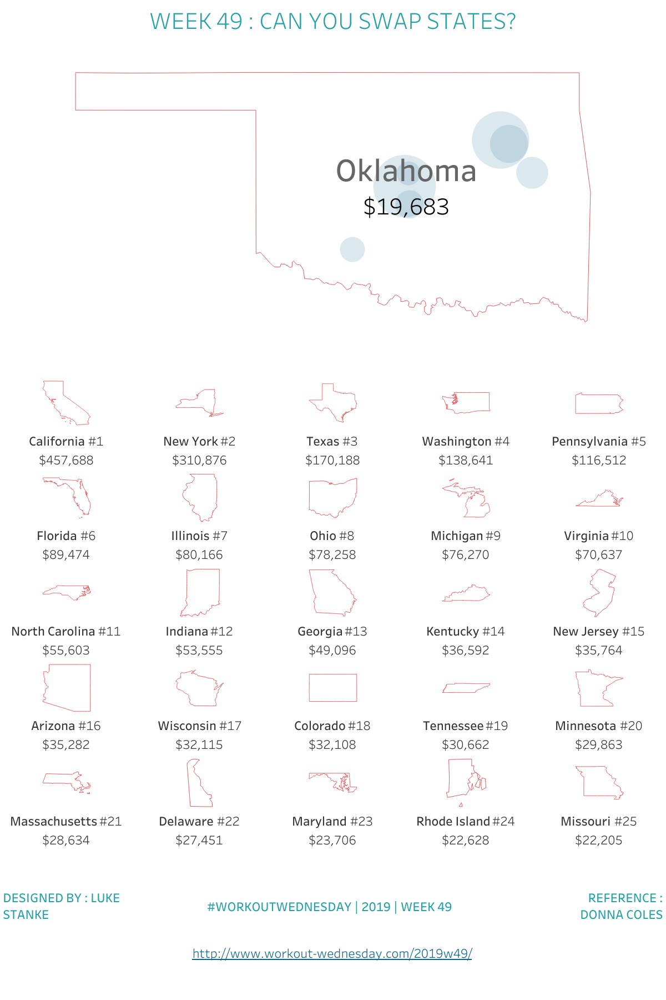

# WW49 Cloud review

Accepted as `replicated / acceptable_delta` within the specified Cloud REST image/data plus artifact-contract scope. The final replica hash is `3a098e64c6044c5a881a0d4205cdd7cefca8f2cb9e273e0d7b8aecec3b169761` and is bound to `cloud-verification.json`. The original and final replica PNGs were independently opened and inspected.

| Author | Replica |
| --- | --- |
|  |  |

Both render Oklahoma's silhouette, seven pale-blue city bubbles, the state name and rounded $19,683 total, plus the complete 5 x 5 trellis in matching sales order with nationwide rank and rounded dollar labels. All 25 visible states from California #1 through Missouri #25 match the independently queried Hyper totals. The extra numeric Cols axis has been removed. Title, teal source credits, challenge footer and challenge URL are present.

Remaining visual differences are smaller selected-map size and margins, slightly different trellis label weight and spacing, and the right credit explicitly saying REFERENCE rather than claiming Donna Coles authored this independent SDK build. These differences do not alter marks, quantities, ordering or action definitions. This is not a pixel-identical match.

The dashboard CSV exports Selected State only: seven cities and the aggregate Oklahoma polygon row. Every city Sales value matches the Hyper aggregation within whole-dollar display rounding; every generated latitude/longitude is populated and matches the author coordinate within 0.00001 degrees. This CSV does not prove the trellis.

The additional author `CHK:Data` export is a diagnostic long-form table containing 26 states: IN Oklahoma and the 25 OUT states. Global and partition ranks are independently checked; only OUT rows are compared to the visible trellis. The replica `States` export covers all 25 OUT states. Its Sales, Global Rank, Cols, Rows and Label Rows match the independent oracle. Unformatted author sales are checked to 0.000001; formatted dollar values allow at most 0.500001 rounding error.

All 49 possible single-state selections are additionally checked by an independent Hyper oracle: 25 highest-sales OUT states, complete positions, nationwide labels and city totals. Selecting California would promote Oklahoma into the OUT top 25. Those alternate selections were not triggered in a browser or through REST. The source worksheet, on-select event, set target, single-selection assignment and preserve-on-clear behavior are verified from the generated artifact.

The initial blank maps and subsequent blank trellis were rejected, not accepted as visual deltas. Their receipts are retained in `cloud-initial-blank-geography.json` and `cloud-intermediate-blank-trellis.json`; generic geocoding context, binary exclusion, hidden-filter partition preservation and InOut addressing fixed them before final capture.
